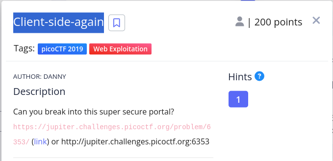
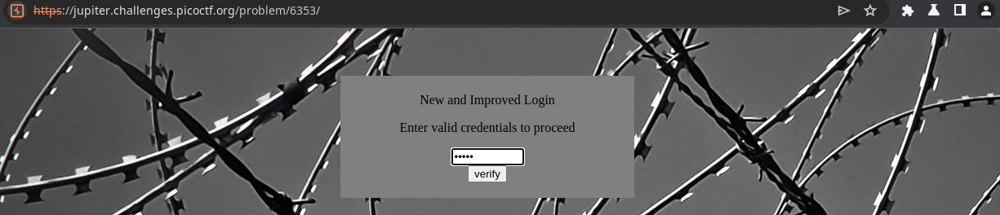
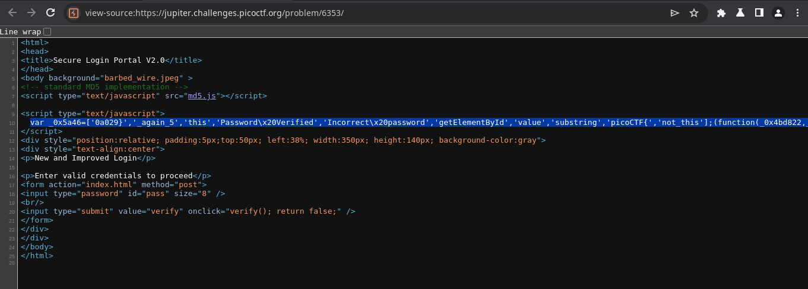
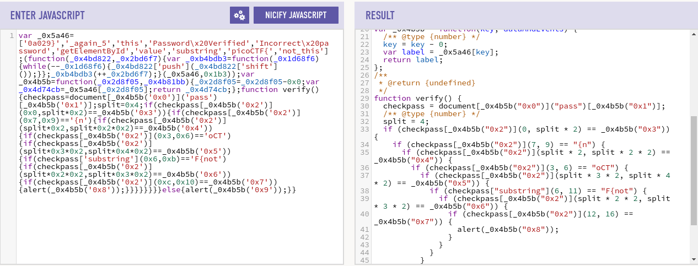
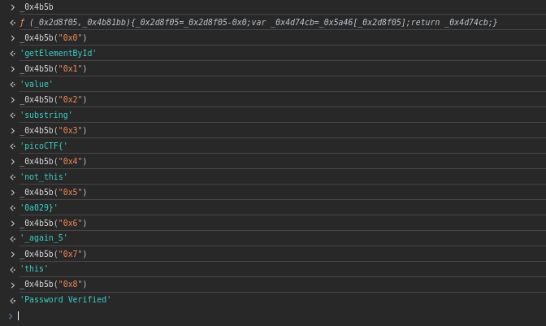
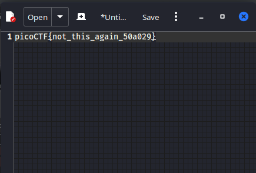

# Problem 
\

\
\

> ## Solution:
\
We entered the link and saw this website.\
\

\
we can't see anything here as the problem statement is saying it is a client side ctf, so we start with the source code. [`press ctrl+U`]\
\

\
in the source code we found a javascript that is messy so we goto the [javascript beautify site](http://www.jsnice.org/) and the result is\
\

\ 
> here we found this `_0x4b5b` function so in the cosole we tried it's input output

\
so here is the result of that - \

\
We got some string. I just randomly test concat those substring and made this \
\

\
it is tested and it is the flag.