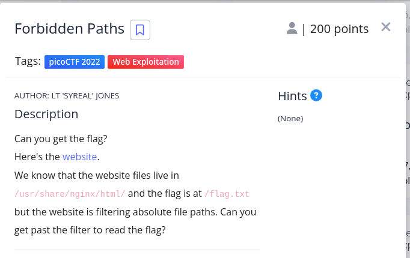
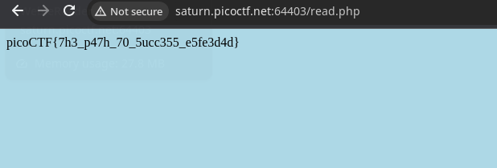

# Here is the problem statement

\
> # Solution:

this is a simple path traversal problem. We can see our website is in `/usr/share/nginx/html/` and we have to access `/flag.txt`\
So all we have to do is put this in the input:\
>`../../../../flag.txt`

\
and the browser will show the flag.\
here is a photo of that\
\

