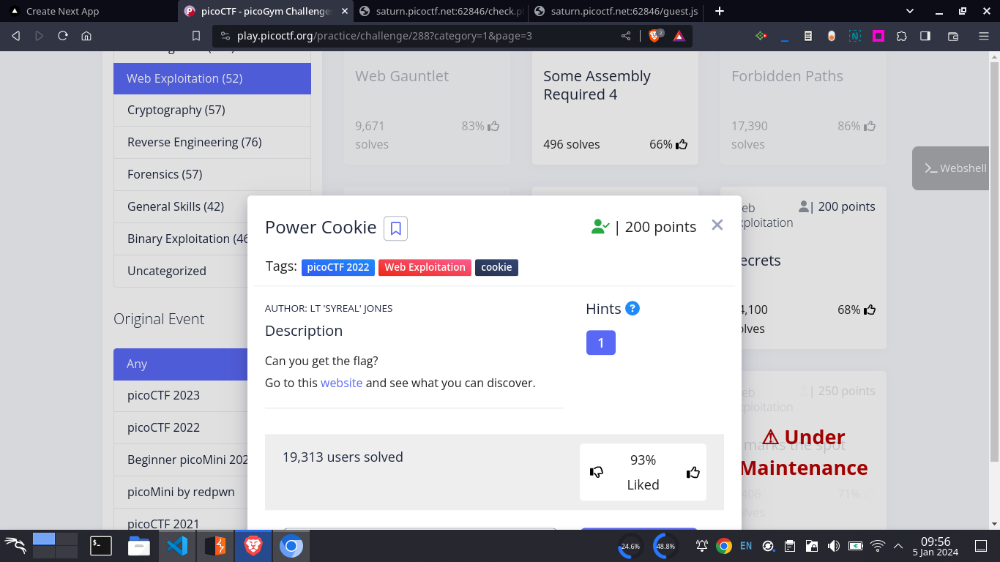
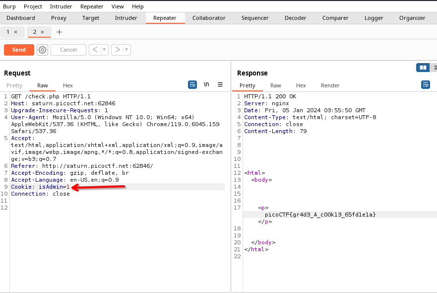

# Here is the problem statement

\
> # Solution:
\
We just looked into all the request we made in the website using burp suite\
in the `/check.php` request we can see that the cookie `isadmin` is `0`\
assuming `0` means false we put `isadmin = 1`\
thus we got our flag.\
\
