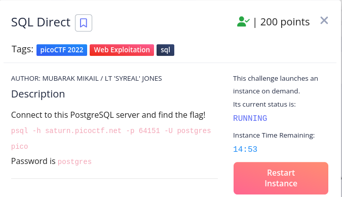
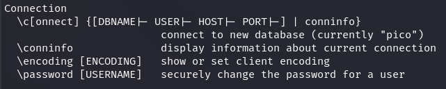
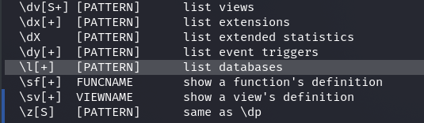

# Here is the problem statement

\
> # Solution:
after connecting the postgres server we find a terminal shell to interact.\
\
first started with the `help` command.\
it showed that to find the commands we must use `\?` \
so after using `\?` command we found some important commands.\
here are they:\
\

\
\

\
\
another one is `\dt` it list all the table name.
\
then the following steps were these:\
\
>pico=# \l
>                                                      List of databases
>   Name    |  Owner   | Encoding | Locale Provider |  Collate   |   Ctype    | ICU Locale | ICU Rules |   Access privileges   
>-----------+----------+----------+-----------------+------------+------------+------------+-----------+-----------------------
> pico      | postgres | UTF8     | libc            | en_US.utf8 | en_US.utf8 |            |           | 
> postgres  | postgres | UTF8     | libc            | en_US.utf8 | en_US.utf8 |            |           | 
> template0 | postgres | UTF8     | libc            | en_US.utf8 | en_US.utf8 |            |           | =c/postgres          +
>           |          |          |                 |            |            |            |           | postgres=CTc/postgres
> template1 | postgres | UTF8     | libc            | en_US.utf8 | en_US.utf8 |            |           | =c/postgres          +
>           |          |          |                 |            |            |            |           | postgres=CTc/postgres
>(4 rows)

\
\
>pico=# \c pico 
>psql (16.1 (Debian 16.1-1), server 15.2 (Debian 15.2-1.pgdg110+1))
>You are now connected to database "pico" as user "postgres".

\
\
>pico-# \dt
>         List of relations
> Schema | Name  | Type  |  Owner   
>--------+-------+-------+----------
> public | flags | table | postgres
>(1 row)
>
>pico=# select * from flags;
> id | firstname | lastname  |                address                 
>----+-----------+-----------+----------------------------------------
>  1 | Luke      | Skywalker | picoCTF{L3arN_S0m3_5qL_t0d4Y_31fd14c0}
>  2 | Leia      | Organa    | Alderaan
>  3 | Han       | Solo      | Corellia
>(3 rows)

\
\
then we just did this command:\
\
`select * from flags;`