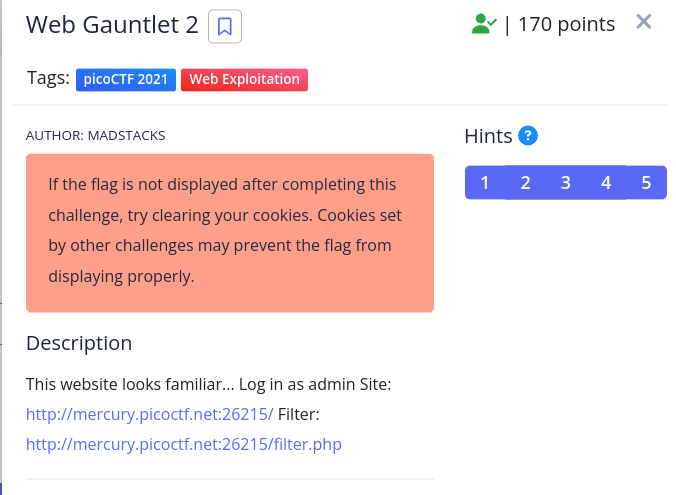
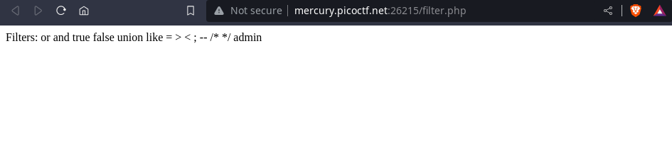
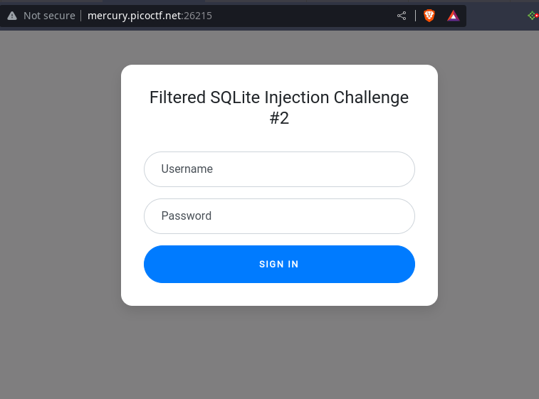
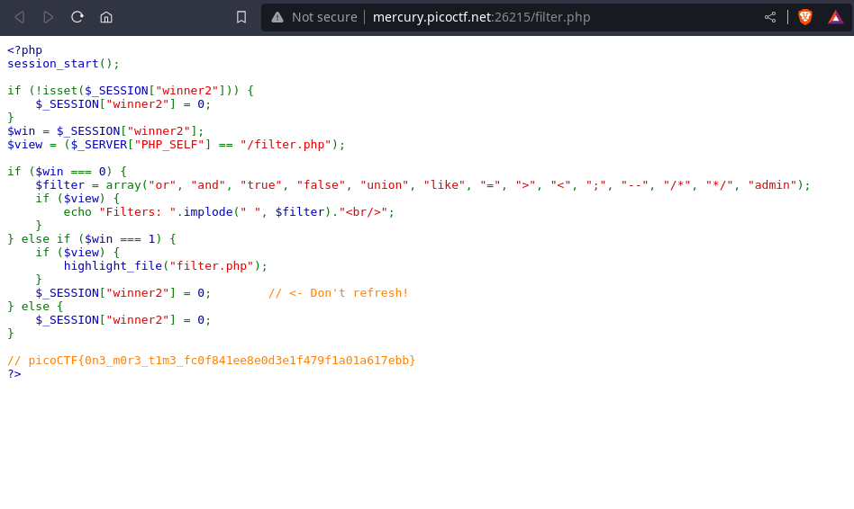

# Web Gauntlet 2

> ## problem statment
>> 

> ## Solution:
> we start by clicking both links given in the statement. here is a photo of filter.php
>
> so we can't use any of the word here cause they are filtered. But that's good cz we are now sure there is a username for admin
> =="||"== this symbol in the sql is used for concatation. So =='ad'||'min'== means =='admin'==
> **here is a photo of main page**
> 
> ==so for username we can use **ad'||'min**==
> now we have to look for some payloads
> [here is a link for some payloads in sqli](https://github.com/swisskyrepo/PayloadsAllTheThings/tree/master/SQL%20Injection)
> None of them are enough cz most of the payload has some word that is filtered
> So now we have to use our SQL knowledge 🦾
> we can use `IS` or `IS NOT` keyword
> for example  ==a' IS NOT 'b== can be used as password
>>when we enter the password and username then the filter.php file give us the below result - 
>> 

> ## Further check 
> 1. Why couldn't we use a' IS 'a 
> 
