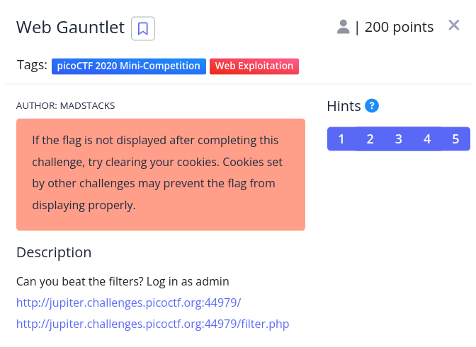
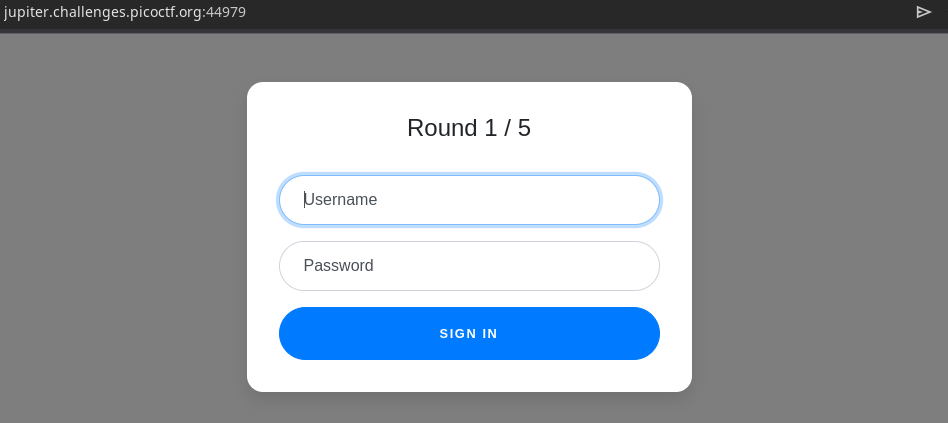
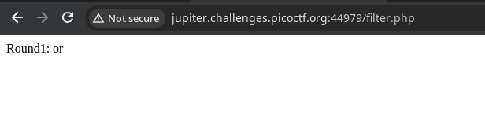

# Problem statement
\

\
\
> ## Solution

We start with going through both links.\
here are the pic of them\
\

\
\

\
Now here we can see the `or is filtered` so we can't use\ `OR` for sqli \
\
so we use the below credentials to login:\
\
> username : `admin`
> password : `a' IS NOT 'b`

\
\
so the website goes to the next level
### level-2:
\
> filter: `Round2: or and like = --`
> username: `admin`
> password: `a' IS NOT 'b`

\
### level-3:
\
> filter: `Round3: or and = like > < --`
> username: `admin`
> password: `a' IS NOT 'b`

my work is done in this - I don't know why it is not \working. I have to look for it and for further i used [this write-up](https://github.com/onealmond/hacking-lab/blob/master/picoctf-2020/web-gauntlet/writeup.md)

