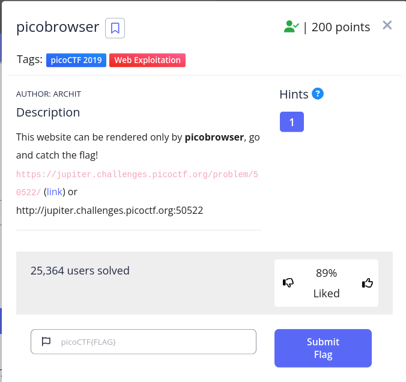
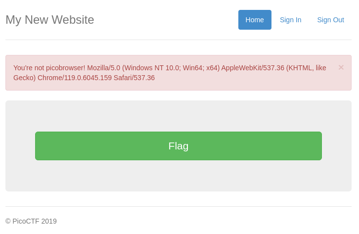
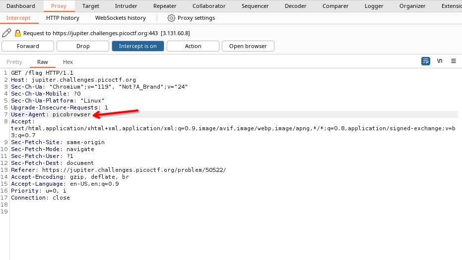
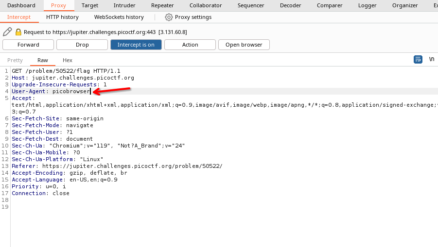
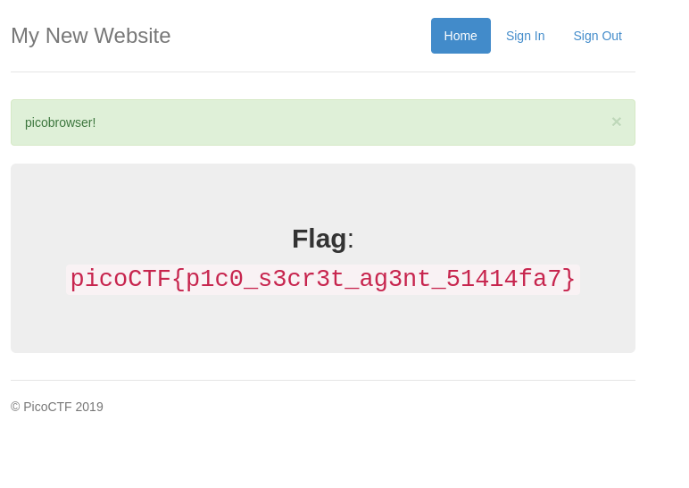

# Here is the problem statement

\
\
\
> # Solution:
\
first of all the solution is in the problem statement. `This website render only for picobrowser` this means we have to do something with `user-agent`
\
so first we opened the link here is the view
\
\

\
then we clicked the flag button and it showed us this output
\

\
so we again requsted for the `/flag` but this time we intercepted all the request and edited the `user-agent` to `picobrowser`.\
Here is a step by step veiw for that -\
\
1. \

\
2. \

\
3.

\

at last in the browser we can see we got out flag\
\
\
> ## after thinking
> 1. we could use the curl command to solve this problem